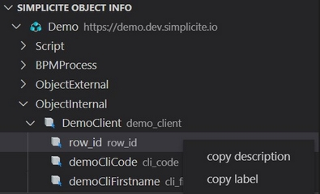
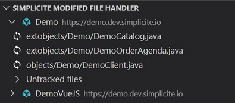

# Simplicite VSCode

Simplicite low code platform tools to make life easier for designers in an IDE environment

---

## Features
- Simplified workflow for designers who prefer to edit java code in their favorite IDE.
- Object field completion.
- Tree view gathering informations on modules objects.

- Tree view to manage your modified files.

<!--  -->

---

## How does it work ?

Simply add your modules into the vscode workspace then authenticate yourself using the credentials of **each simplicite instance** you need to log in.
Opening the same workspace later will **automatically connect you**.

From now on, you can edit your java files and run the command: `Simplicite: Apply change(s)` to load the files on your simplicite instance(s).
 
Your files will get marked as modified on save.
You can manage them in the *SIMPLICITE FILE HANDLER* tree view.

---

## Available commands
* `Simplicite: Apply changes`: loads the java files into their modules. Requires to be logged in. Running this command will trigger local compilation, you can disable this step in the settings. Once all your files are applied, your Simplicite instance(s) will run another compilation.
* `Simplicite: Apply specific module changes`: same as the above command but you'll be asked to type in the module name.
* `Simplicite: Compile java code in workspace`: executes the compilation command of the [vscode-java extension](https://github.com/redhat-developer/vscode-java#available-commands).
* `Simplicite: Log into detected instances`: logs into the instances that have been detected in the modules contained in the workspace.
* `Simplicite: Log into specific instance`: logs into a specific instance. Both module name and instance url are accepted.
* `Simplicite: Log out from all instances`: logs out all the instances.
* `Simplicite: Log out from specific instance`: logs out a specific instance. Both module name and instance url are accepted.
* `Simplicite: Track file`: marks the file as modified. The input field accepts file absolute path or file name (ex: *Demo.java* or just *Demo*).
* `Simplicite: Untrack file`: marks the file as unmodified. The input field accepts file absolute path or file name (ex: *Demo.java* or just *Demo*).

---

## Extension Settings

* `simplicite-vscode-tools.compilation.enabled`: Enable/disable local compilation before applying changes.
* `simplicite-vscode-tools.api.autoConnect`: Enable/disable automatic connexion features.

---

## Known Issues

---

## Release Notes

### 1.0.0
Initial release

---
