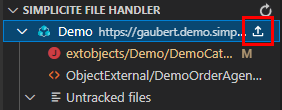

* * *

Simplicite VSCode tools
=======================

Simplicite low code platform tools to make life easier for designers in an IDE environment.

* * *

Features
--------

- Simplified workflows for designers who prefer to edit Simplicite code in their favorite IDE.
- Object field completion.
- Tree view gathering informations on modules objects.
- Tree view to manage your modified files.

* * *

How does it work ?
------------------

Add Simplicité module(s) in your workspace :
- using the `"Add Folder to Workspace..."` VS Code feature to add modules from your local storage.
- using the api file system command `"Simplicite: Initialize api file system"`.

> Note : **Authenticating is mandatory** to use the features of the extension.

### Editing files

The main feature of the extension is the ability to edit your files in your IDE and applying the changes without having to commit/push.

You can go in the settings (_File > Preferences > Settings > Extensions > Simplicite VSCode tools > Api: Send File On Save_) and change the behavior of this feature :

- Mark the setting as true to apply your file changes on save.
- Mark it as false to display the File Handler tree view and manage your changes from there (see the *Applying Files* section below).

### Applying Files

> Note : this section is relevant only if the `"simplicite-vscode-tools.api.sendFileOnSave"` setting is set to `false`.

The File Handler tree view is a usefull tool to handle your modifications.

Each time you save a file, its state will change as *"tracked"*. You can manually set a file as tracked by clicking on the "+" icon or set as untracked by clicking on the "-" icon.

To apply your changes, simply click on the highlighted button shown below.

Good to know : **every action available in the tree views** (File Handler and Module Info) **is in fact a command.**

### Completion

The completion service is triggered by functions such as `getField(...)` and is able to display the list of the current object attributes.

If you want to access to the various attributes of any object, you can use the *Module Info* tree view. Right clicking on an item displays a menu that let you choose which attribute you want to copy in your clipboard. Also double clicking will copy the label of the item to the location of your cursor.

* * *

Available Commands
------------------

### Applying Changes

- `Simplicite: Apply changes` : Apply all the changes.
- `Simplicite: Apply specific instance changes` : Apply the changes of a given instance.
- `Simplicite: Apply specific module changes` : Apply the changes of a given module.

### Authentication

- `Simplicite: Log into detected instances` : Log into the instances that have been detected in the modules contained in the workspace.
- `Simplicite: Log into specific instance` : Log into every module of a given instance.
- `Simplicite: Log out from all instances` : Log out from all instances.
- `Simplicite: Log out from specific instance` : Log out from a given instance.

### Refresh Tree Views

- `Simplicite: Refresh the Module Info tree view`.
- `Simplicite: Refresh the File Handler tree view`.

### File status

- `Simplicite: Track file` : Marks the file as tracked. The input field expects the file's absolute path.
- `Simplicite: Untrack file` : Marks the file as untracked. The input field expects the file's absolute path.

### Api File System

- `Simplicite: Initialize Api File System` : Initialize a new module in the workspace using the Api of a given Simplicité instance.
- `Simplicite: Remove Api File System` : Remove a module previously added with the command above.

* * *

Extension Settings
------------------

- `simplicite-vscode-tools.api.autoAuthentication` : Enable the automatic authentication on the simplicite extension launch. Note that you have to be authenticated in order to take profit of most of the extension features.
- `simplicite-vscode-tools.api.sendFileOnSave` : Enable sending modified file on save. When this setting is enabled, the *File Handler* tree view won't be displayed.

Key bindings
------------

- `simplicite-vscode-tools.showSimpliciteCommands` : Open a Quick Pick menu displaying every command of the extension. The shortcut can be edited in *File > Preferences > Keyboard shortcuts > simplicite-vscode-tools.showSimpliciteCommands*.

Known limitations :
When initializing an api module in a VS Code instance on destkop and opening another instance will cause the api module to initialize in both instances. (workspace)